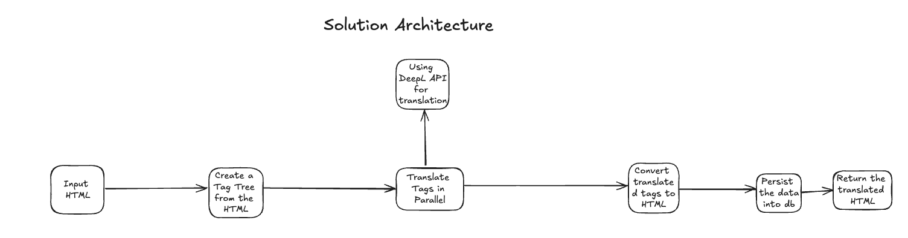

# python-django-service

A Python Django Service for translation

This is a Python based Django service that provides endpoints for creating translation and retrieving user translations.

The design decisions of this service have been based on the discussion [here](https://docs.google.com/document/d/1kh2ybkZPr9LXM5Yv08-6CU1FTEjTqkUb0ZdYhKPEx8M/edit?usp=sharing).

### Architecture


Excalidraw Flow Diagram: https://excalidraw.com/#json=yyBV76AJi0DZ0Gg7oHn5a,JCzDkcdZk1INg8QId7b5Dw

### Prerequisites

Project requires
1. python 3.10.8
2. pyenv
3. docker
4. docker-desktop
5. poetry (version 1.6.1)

Install `pyenv` tool to manage python version.

#### Install container runtime

```bash
# install docker
brew install docker
brew link docker # optional

# install docker-compose
brew install docker-compose

```

### Running
First create a **.env** file and copy the secrets I have shared with you.

```bash
# via docker
docker compose up -d
docker-compose exec service bash
make create-migration
make migrate
make create-superuser
make run
```

The application is accessible at <http://localhost:8000>.

You can also access the API definitons at <http://localhost:8000/redoc>


### Testing

`pytest` will run all unit tests that you specify in your codebase.

As pytest convention, all files matching `test_*.py` will be included.

#### Running tests
```bash
docker-compose exec service bash
poetry run pytest -v
```


## Deploy the API endpoint locally
1. Create Django tables and super user
```bash
docker-compose up -d
make create-migration
make migrate
make create-superuser
make run
```

2. Login to django admin <http://localhost:8000/admin>
3. Create an API Key
4. call translate endpoint
```bash
curl --location 'localhost:8000/v1/translation/translate' \
--header 'Content-Type: application/json' \
--header 'Authorization: Api-Key {API_KEY}' \
--data '{
    "user_id": "119c40ef-2e9f-4992-9433-94ef99daeb19",
    "format": "html",
    "original_content": "<div><h2 class='\''editor-heading-h2'\'' dir='\''ltr'\''><span>hallo1 as headline</span></h2><p class='\''editor-paragraph'\'' dir='\''ltr'\''><br></p><p class='\''editor-paragraph'\'' dir='\''ltr'\''><span>hallo2 as paragraph</span></p><p class='\''editor-paragraph'\'' dir='\''ltr'\''><span>hallo3 as paragraph with </span><b><strong class='\''editor-text-bold'\''>bold</strong></b><span> inline</span></p></div>"
}
'
```

### System Constraints:
1. Does not translate time tags at present
2. Can not translate text on the buttons
3. Instead of treating
```html
<span>hallo3 as paragraph with </span><b><strong class='editor-text-bold'>bold</strong></b><span> inline</span>

```
as one block for translation, the current implementation splits it into multiple components for translation:
```html
<span>hallo3 as paragraph with </span>
<b><strong class='editor-text-bold'>bold</strong></b>
<span> inline</span>
```
